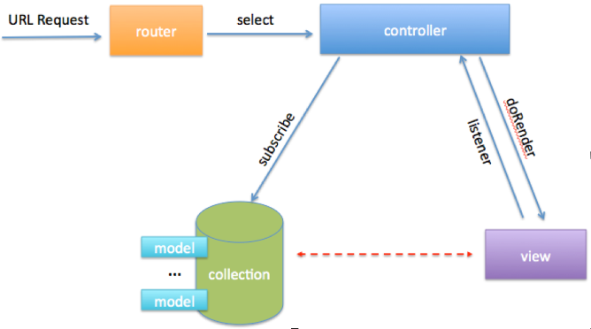
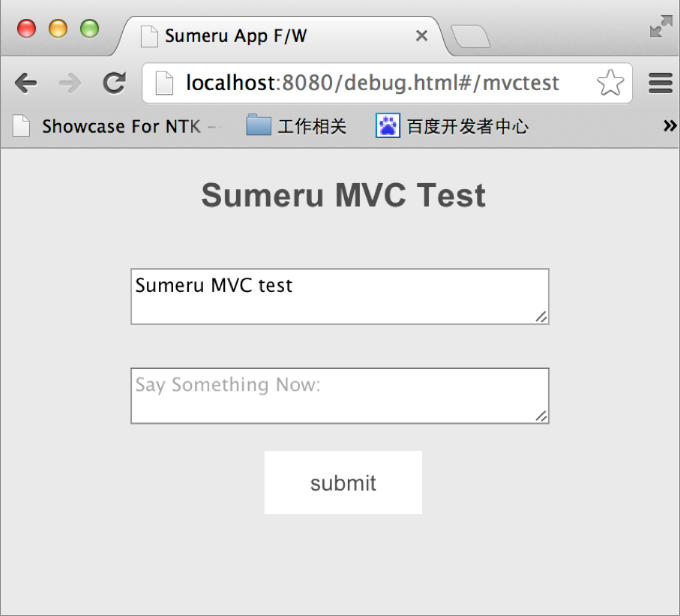

## Sumeru MVC简介

在《Sumeru入门文档》中介绍了如何使用Suemru开发简单的“Hello World”，在“Hello World”中使用了Controller和View，Suemru采用MVC模式开发，在该文档通过“mvcTest”实例来介绍如何在Suemru框架中加入model。

### 一. Sumeru MVC介绍

首先简单的介绍一下Sumeru的MVC框架，Sumeru采用MVC（Model、View、Controller）模式开发，Model存放业务数据，View作为前端视图展现，在MVC模式下，View与Model是不能直接通讯，需要通过Controller将两者联系起来， Controller是Model与View的桥梁。

#### 1.1  Sumeru MVC模型图

Sumeru MVC模型图如下:

#### 1.2 Controller

Sumeru框架中Controller由onload()、onrender()、onready()三个⽣生命周期组 成,分别完成的功能如下:

##### 1.2.1 onload()

controller第⼀一个⽣生命周期,完成controller的初始化,以及数据准备(主要是渲 染视图时需要的数据),对server端数据订阅(subscribe)以及将订阅的数据与 view进⾏行绑定在这个周期中完成。

##### 1.2.2 onrender()

controller第⼆二个⽣生命周期,完成对视图(view)的渲染,并可在该周期中定义 视图的转场⽅方式(push、rotae、fade、shake)以及⽅方向。(了解更多请查看http:// sumeru.duapp.com/apilist.html中transition API)

##### 1.2.3 onready()

controller的第三个⽣生命周期,视图渲染完成后,在这个周期主要是对view的 DOM进⾏行监听以及定义如何响应。

#### 1.3 View

view是指⽤用户界⾯面,Sumeru中view的添加⽅方法如下:

	<block tpl-id= "test_container" >

		//view 添加到此处

	</block>


#### 1.4 Model

Model中存放业务数据模型,Sumeru中Model的操作⽅方法如下:

	Model.modelName= function(exports){ 

		exports.config = {

			fields : [
				{name: 'fieldName', type: 'text'}
			] 

		};
	};


### 二. 使用Suemru MVC模式开发实例

#### 2.1 实例预览


##### 2.2.1 实例在线预览


<http://sumerudemo.duapp.com/debug.html#/mvctest>


2.2.2  实例预览图

#### 2.2 具体实现方法

**(1) 在model文件夹下创建mvcTestModel.js和package.js文件**

mvcTestModel

	Model.mvcTestModel = function(exports){
	
		exports.config = {
		
			fields : [
				{name: 'content', type: 'text'},
				{name: 'time', type: 'datatime',defaultValue: 'now()'}
			]

		};
	};

pacakge.js

	sumeru.packages(

		'mvcTestModel.js'

	);

**(2) 在view文件夹下创建mvcTest.html**

mvcTest.html

	<block tpl-id="mvctest_container">
		

		
			<h1 style="margin-top: 20px;">Sumeru MVC Test</h1>			
		 	<textarea id="feedInput" placeholder="Say Something Now:" style="width: 260px;margin-top: 20px;"></textarea>  
		   <button class="butRad2" id="feedSubmit" style="height: 40px;width: 100px; margin-top: 10px ; background-color: #fff">submit</button>  
			<textarea readonly="readonly" id="content" style="width: 260px; margin-top: 20px;">{{data.content}}</textarea>  	
	
			<button class="butRad2" id="clearHistory" style="height: 40px;width: 100px; margin-top: 10px ; background-color: #fff">clear history</button> 
	
		

	</block>

**(3) 在publish文件夹下创建mvcTest.js**

mvcTest.js

	module.exports = function(fw){

		fw.publish('mvcTestModel', 'pub-mvctest', function(callback){

			var collection = this;

			collection.find({}, {}, function(err, items){
				callback(items);
		 	});
		});   
	}

**(4) 在controller目录下创建mvcTestController.jsd和package.js**

mvcTestController.js

	(function(sumeru){
		App.mvcTest = sumeru.controller.create(function(env, session){
		
			var getMsgs = function(){       

				session.messages = env.subscribe('Model.mvcTestModel','pub-mvctest', function(msgCollection){
		
					//manipulate synced collection and bind it to serveral view blocks.
		            session.bind('mvctest_container', {
		            	data    :   msgCollection.get(msgCollection.find().length - 1),
		            });              

		        });
			};
		
			//onload is respond for handle all data subscription
			env.onload = function(){            
				return [getMsgs];            
			};
		
			//sceneRender is respond for handle view render and transition
			env.onrender = function(doRender){
				doRender('mvcTest', ['push', 'left']);
			};
		
			//onready is respond for event binding and data manipulate
			env.onready = function(){
		
				session.event('mvctest_container', function(){                   
		     		document.getElementById('feedSubmit').addEventListener('click', submitMessage); 

		     		document.getElementById('clearHistory').addEventListener('click',clearHistory);                             
		        });
			};
		
			var submitMessage = function(){
				var input = document.getElementById('feedInput'),
		        	inputVal = input.value.trim();
		
		       	if (inputVal == '') {
		           return false; 
		       	};
		
		       	session.messages.add({
		           content : inputVal,         
		       	});

		       	session.messages.save();
		       	input.value = '';          
			};

			var clearHistory = function(){
				seesion.messages.destroy();
				seesion.messages.save();
			}
		
		});
	})(sumeru);

package.js

	sumeru.packages{
	
		'mvcTestController.js'

	};

**(5) 修改config/route.js文件**

	sumeru.router.add(

		{
			pattern    :   '/mvctest',
			action  :   'App.mvcTest'
		}
	);
	

