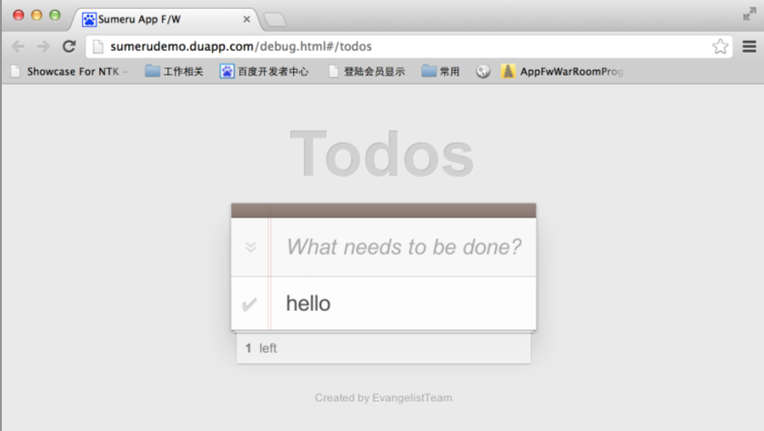
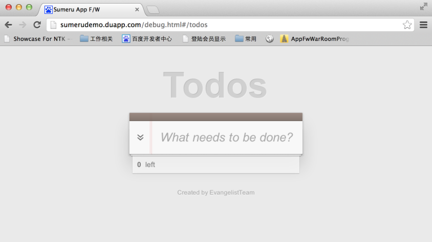
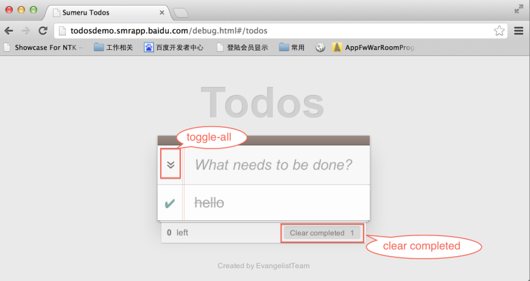
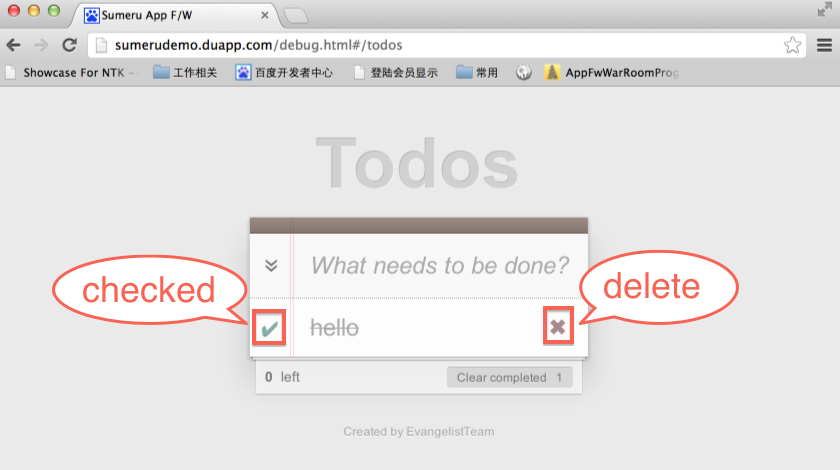
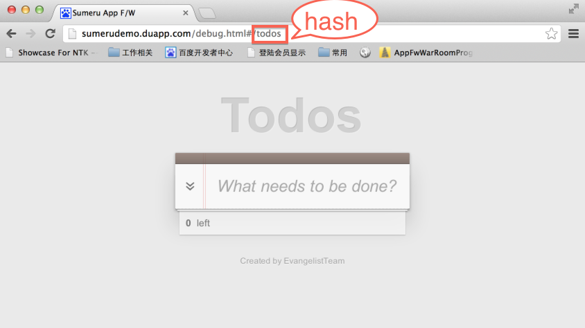

## Sumeru Todos Demo

## 一. 简介

在《Suemru MVC简介》中介绍如何在Suemru中添加model，使用了完整的MVC模式开发了“mvcTest”实例，在这篇文档中将更加深入将如何使用Suemru快速的开发一个webapp---“Todos”。

### 1. Todos Demo介绍

Todos Demo功能是记录用户需要完成的任务列表，当任务完成后可删除已经完成的任务。

#### 1.1 预览地址

<http://sumerudemo.duapp.com/debug.html#/todos>

#### 1. 2 预览图

### 2. Todos Demo作用

本文档以Todos Demo为例，介绍Sumeru Framework结构以及相关的语法，并重点介绍如何使用Suemru Framework开发webapp。

## 二. 如何使用Sumeru Framework开发Todos Demo

###1. 在model文件夹下添加todosModel.js和package.json

todosModel.js:


	Model.todosModel = function(exports){   

    	exports.config = {

          	fields: [

              	{name:'task', type:'string', defaultValue:''},

              	{name:'completed', type:'boolean', defaultValue:'false'},

              	{name:'time', type:'datetime', defaultValue:'now()'}

          	]
      	};  
  	};

  	

参数说明：

	task：任务名；

	completed：任务是否完成的标志，false表示未完成，true表示已完成；

	time：任务的创建时间


package.json:

	suemru.packages{

		' todosModel.js '    //只有一项或者是最后一项时，不要加‘ ，’（逗号）
	
  	};

### 2. 在controller/文件下编写todosController.js和修改package.json 


由于Todos任务的相关信息都存储在云端(server)，因此在controller中首先从云端订阅所需要的数据，具体的方法如下：


todosController.js

	(function(sumeru){

   		App.todos = sumeru.controller.create(function(env, session){

        	var getMsgs = function(){

            	session.messages = env.subscribe('Model.todosModel','pub-todos', function(msgCollection){

                 	//获得collection按照time降序排序
            		msgCollection.addSorters("time","DESC");

                  	session.bind('todos_container', {

                    	data    :  msgCollection.find(),

                      	//是否所有的任务都被选中
                      	isAllChecked : msgCollection.find({completed : false}).length == 0,

                      	//是否有任务被选中
                      	isChecked : msgCollection.find({completed : true}).length > 0,

                      	//任务没有完成数
                      	unCompleted : msgCollection.find({completed : false}).length,

                      	//任务完成的数
                     	commpleted: msgCollection.find({completed : true}).length
                  			
                  	});
             	});         
          	};

          	env.onload = function(){
              	return [getMsgs];      
          	};

         	env.onrender = function(doRender){   
             	doRender('todos', ['push', 'left']);
         	};

         	env.onready = function(){

          	};
      });

  	})(sumeru);


参数说明：


	Model.todosModel：上一步创建的model名；

	pub-todos：publish中定义的push model名，必须与publish文件中保持一致（后续在publish文件中介绍）；

	todos_container：在view中绑定数据（使用数据）元素或者模块的ID；

	todos：在view文件夹下的视图todos.html,该文件将在第四步创建

package.json：

	suemru.packages{
	
		'todosController.js'
	
  	};

### 3. 在publish/文件夹下编写todos.js文件 

在publish/文件夹下添加todos.js文件，该文件定义云端会将什么类型的数据push到client端，具体如下：


	module.exports = function(fw){

  		fw.publish('todosModel', 'pub-todos', function(callback){

        	var collection = this;

          	collection.find({}, {}, function(err, items){

           		callback(items);

          	});
      	});
  	}

  参数说明：

	todosModel：第一步创建的model名；

	pub-todos：云端push model名，与controller中subscribe的第二个参数保持一致；

	

###  4. 在view下编写todos.html 

在第二步的controller中subscribe方法中通过session.bind()方法将数据绑定到view指定的模块或者元素上，该模块或者元素内部可以使用handerbars语法来获取和使用数据（关于handerbars的语法请查看：<http://handlebarsjs.com>）。

todos.html

	<block tpl-id="todos">

  		


       		<header id="header">
           		<h1>Todos</h1>
              	<input id="new-todo" placeholder="What needs to be done?" autofocus="autofocus">
         	</header>

          	<section id="main">

              	<input id="toggle-all" type="checkbox" {{#if isAllChecked}} checked = "true" {{/if}}>
              		<label for="toggle-all">Mark all as complete</label>
             			<ul id="todo-list" class="data-cloak">
                  			{{#each data}}
                      			<li>
                          			


                              			{{#if this.completed}}                  
                                  															<input class="toggle" type="checkbox" checked="checked" value="{{this.time}}" data-id="{{this.smr_id}}" status="{{this.completed}}"> 
                                 						 									<s><label style="color: #a9a9a9;  text-decoration: line-through;">{{this.task}}</label></s>
                              			{{else}}
                                  															<input class="toggle" type="checkbox" value="{{this.time}}" data-id="{{this.smr_id}}" status="{{this.completed}}">
                                  						<label>{{this.task}}</label>                 
                              			{{/if}} 
                               
                              			<button class="destroy" data-id="{{this.smr_id}}"></button>
                          		

                                                							</li>
                  		{{/each}}
             		</ul>

         	</section>

          	<footer id="footer" class="data-cloak">

              	<strong>{{unCompleted}}</strong>&nbsp; left
              	<button id="clear-completed">Clear completed  &nbsp; {{commpleted}}</button>

          	</footer>
  		


 		

      	
 
          
         		
Created by EvangelistTeam
              
      	


  	</block>

  完整的代码请查看：

  <http://sumerudemo.duapp.com/view/todos.html>  (使用浏览器查看源码) 

### 5. 在assets/css/文件夹下编写todos.css 

todos.html完成后，需要使用css样式进行美化，详细的css的代码请查看：

<http://sumeru.duapp.com/assets/css/todos.css>

直接将内容添加到todos.css文件中，完成后的效果图如下。

	

### 6.修改controller文件下的todosController.js 

修改controller文件夹下的todosController.js文件，在env.onready()方法中添加对view事件的监听和响应。 


**6.1 controller中添加输入任务名后对回车事件的响应**

	env.onready = function(){

  		var event = 'click';
      	var keyboardMap = {
         		 'enter' : 13
     	};
     	var getId = function(id){return document.getElementById(id)};

      	session.event('todos', function(){

       		session.eventMap('#new-todo', {
           		'keydown' : function(e){
               		if(e.keyCode == keyboardMap.enter){
                   		//用户按下回车后将输入的内容存入数据库
                     	addTodos();
                  	}   
              	},
             	'focus' : function(e){
                 	session.messages.hold();
              	},
             	'blur' : function(e){
               		if (this.value.trim() == '') {
                  		session.messages.releaseHold();  
                 	};    
             	}
      		});
		});
  	};

 	//将用户输入的信息添加到数据库中    
  	var addTodos = function(){
  		var input = document.getElementById('new-todo'),
     		inputVal = input.value.trim();

 		if (inputVal == '') {
      		return false; 
  		};

  		session.messages.add({
      		task : inputVal,
      		completed: false,
      		time : (new Date()).valueOf()            
  		});
 		session.messages.save();
  		input.value = ' ';
  		session.messages.releaseHold();
  	}; 

输入信息后按回车的效果图：

 

**6.2 controller中添加对全选按钮事件的响应**

	env.onready = function(){

 		document.getElementById('toggle-all').addEventListener(' click ',toggleAll); 

 	};

 	//选中全部任务   
  	var toggleAll = function(){

  		if(document.getElementById('toggle-all').checked){  

          		session.messages.update({completed : true},{completed : false}); 
          		session.messages.save();   
         
      	}else{  
            
          		session.messages.update({completed : false},{completed : true}); 
          		session.messages.save();

      	}

  	}; 

添加后点击的效果图：


**6.3 controller中添加clear completed按钮的响应**

	env.onready = function(){

 		document.getElementById('footer').addEventListener(event, function(e){
        	var e = e || window.event,
          	target = e.target || e.srcElement;

          	if(target.tagName.toLowerCase() == 'button'){
              	//在数据库中删除所有完成了任务
              	session.messages.destroy({completed: true});
              	session.messages.save();
          	}                             
      	});
 	};

 	
添加后点击的效果图：

 	

 
**6.4 controller中添加对单条数据选中和删除单条数据的事件响应**

	env.onready = function(){

  		document.getElementById('main').addEventListener(event, function(e){
        	var e = e || window.event,
          	target = e.target || e.srcElement;

          	if(target.tagName.toLowerCase() == 'button' && target.hasAttribute('data-id')){
              	//删除选中的单条任务
              	var smr_id = target.getAttribute('data-id');
              	session.messages.destroy({smr_id : smr_id});
             	session.messages.save();
          	}

          	if(target.tagName.toLowerCase() == 'input' && target.hasAttribute('data-id') && target.hasAttribute('status')){
           		var smr_id = target.getAttribute('data-id');
              	var status = target.getAttribute('status');

              	//改变数据库中任务的完成状态
              	if(status){
               		session.messages.update({completed : false},{smr_id : smr_id});
              	}else{                              
                  	session.messages.update({completed : true},{smr_id : smr_id});
              	}
              		session.messages.save();
          	}
      	});
 	};

 添加后点击的效果图：

 	

** 6.5 todosController.js源码获得地址 **

<http://sumeru.duapp.com/controller/todosController.js>


 ### 7.在config/文件下修改router.js

 在router.js中加入hash与controller的键值对。

	Sumeru.router.add(

 		{

          	pattern    :   '/todos',
          	action  :   'App.todos'
      	}

  	); 

 
 
