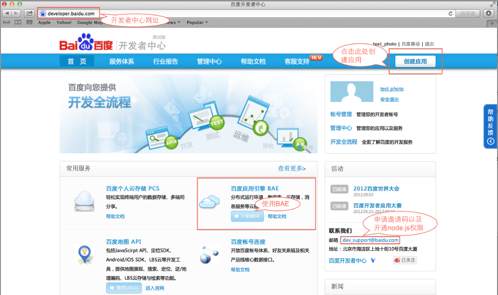
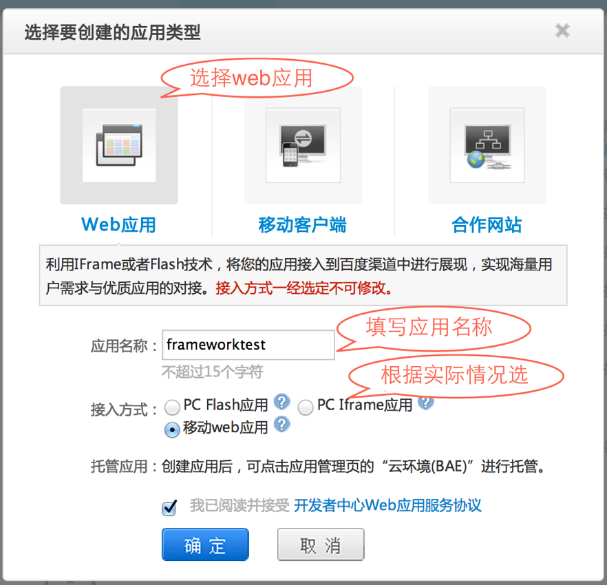
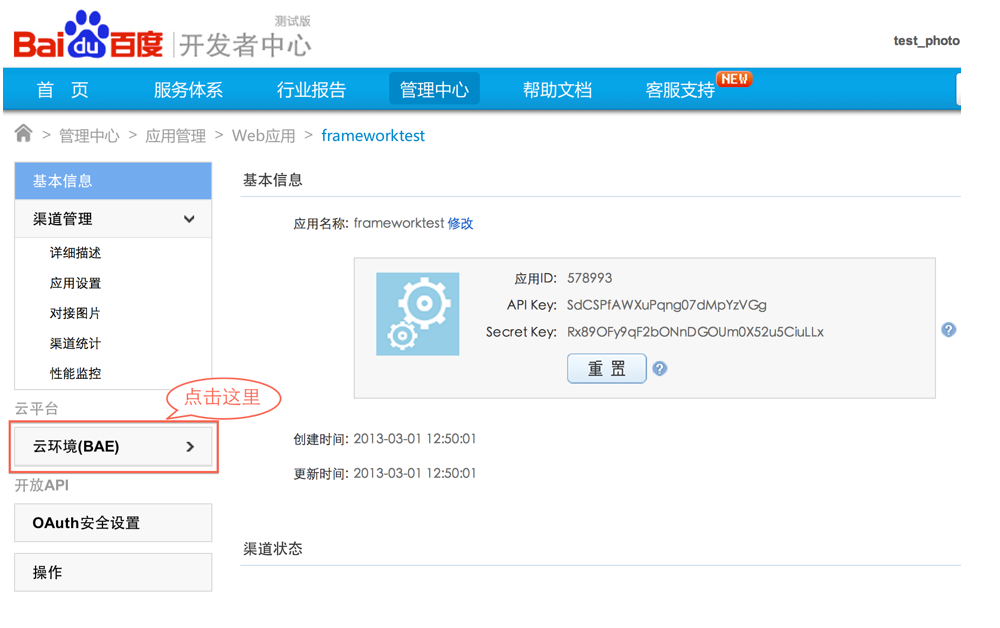
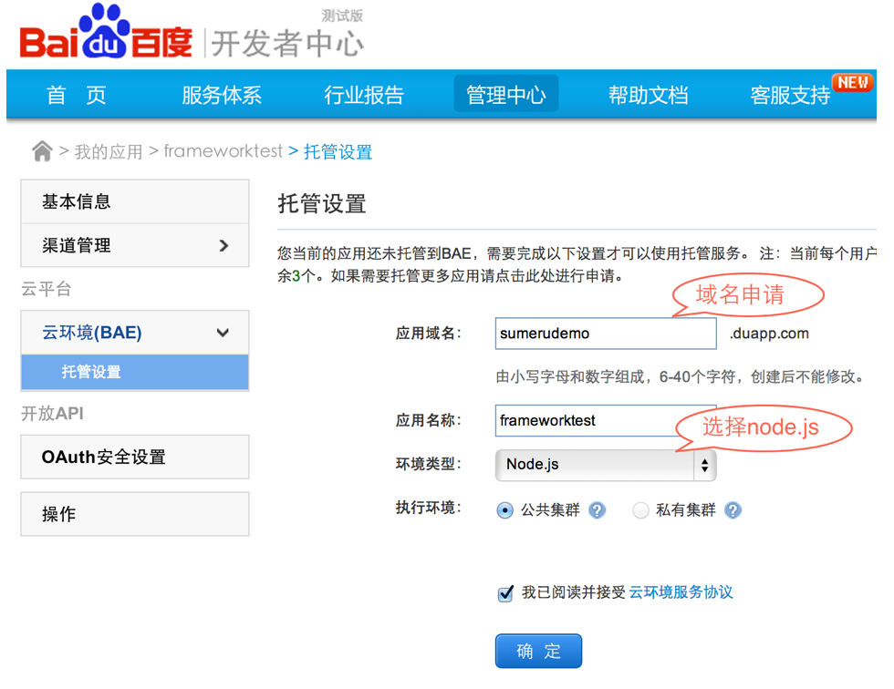
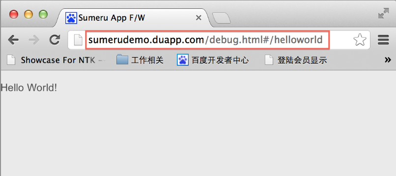

## Sumeru framework入门文档


### 一. Sumeru Framework介绍

#### 1.1 什么是Sumeru Framework？

欢迎来到Sumeru的世界，在这里，您将获得超乎想象、无比便捷的开发体验！

Sumeru Framework是以Javascript为唯一开发语言并专注于开发移动App的云端统一开发框架，使用Sumeru Framework开发的App，既可以作为Web App运行，也可以打包作为Native App安装，其以打造全新App架构为使命，提供使用Javascript抹平云和端的新世界，你将不再需要切换语言分别编写服务器和客户端逻辑；你将不再需要花费原来50%以上的精力遍历、操作DOM和管理链接，只需专心编写最核心的业务逻辑。


#### 1.2 Sumeru Framework下载与安装


### 二. 如何使用Sumeru开发“Hello World”

在第一节对Sumeru做了简单介绍， Sumeru采用MVC模式进行开发 ，下面通过“Hello World”实例来介绍如何使用Sumeru进行开发。


####2.1 “Hello World”实例预览地址

<http://sumerudemo.duapp.com/debug.html#/helloworld>

####2.2 具体实现

 （1）在controller文件夹下编写helloworldController.js和修改package.js，文件内容如下：

* helloworldController.js


		sumeru.router.add(

			{
				pattern: '/helloworld',
				action: 'App.helloworld'
			}

		);

		(function (sumeru){

			App.helloworld = sumeru.controller.create(function(env,session){

				env.onload = function(){
					return [function(){}];
				};

				env.onrender = function(doRender){
					//渲染view，这里渲染的是view文件夹下helloworld.html，并定义转场的方式是push
					doRender("helloworld",["push", "left"]);
				};

				env.onready = function(){
					//对view中的事件进行绑定和监听
				};

			});	

		})(sumeru);


helloworldController.js中首先添加一个router，router的作用是添加hash和与之对应的controller，框架根据请求URL中hash部分在router中找到与之匹配的controller响应，其次创建一个Controller，Controller由onload()、onrender()、onready()三个生命周期组成。

* package.js:

		sumeru.packages(

			'helloworldController.js'

		);

package.js作用是将文件内的文件或者文件夹添加到工程，上面代码是将“helloworldController.js”文件添加到工程。

（2）在view文件夹下创建helloworld.html文件，文件内容如下：

* helloworld.html

		<block tpl-id= "helloworld">
			
 Hello World! 

		</block>

	

####2.3 如何运行？

Framework是基于node.js开发的，所以需要node.js环境以及需要数据库的支持，百度开发者中心上BAE提供整套的环境的支持，只需简单的配置就可以快速运行基于framework开发的应用，具体方法如下：


（1）登陆[百度开发者中心](http://developer.baidu.com)，如果没有百度帐号请先注册百度帐号，并注册成为开发者；


（2）使用BAE，如果是第一次使用，需要先发送邮件到dev_support@baidu.com申请开通node.js权限。



（3）node.js权限开通后，点击 “创建应用” ，如图：


（4）点击 “确定”后在页面点击“云环境(BAE)”


（5）完成“应用域名”申请，以及选择使用“node.js”环境


（6）修改app.conf文件

	handlers:
  	  - url : ^/socket/(.*)
    	script: $1.nodejs
    
      - url : ^/view/(.*)
        script: /__bae__/bin/view/$1
   
      - url : ^/bin/(.*)
        script: /__bae__/bin/$1

      - url : ^/static/(.*)
        script: /__bae__/static/$1 
        
      - url : ^/publish/(.*)
        script: /index.html 
    
      - url : /server/(.*)
        script: /index.html 

      - url : (*.ico)
        script: $1    
    
      - url : (*.html)
        script: $1

      - expire : .jpg modify 10 years
      - expire : .swf modify 10 years
      - expire : .png modify 10 years
      - expire : .gif modify 10 years
      - expire : .JPG modify 10 years
      - expire : .ico modify 10 years
	
（7）修改app.js文件

		require("./server/run.js");
	

（8）修改Sumeru框架中sumeru/frameworkConfig.js文件，修改如下：
	

	去掉 35行注释

（9）进入build/tools/，并运行 node.js runBuild.js


（10）使用SVN上传代码，并在BAE上上线该应用


（11）在浏览器中输入：http://sumerudemo.duapp.com/debug.html#/helloworld




### 三. Sumeru目录介绍


在第二节中介绍了如何使用Sumeru开发“Hello World”实例，大家对Sumeru开发有个大概的了解，下面详细介绍一下Sumeru框架的目录结构以及作用。

* assets/

	该文件夹存放应用资源，以下列举一些：

	* css/

	
		存放应用css文件

		
	* images/

	
		存放应用的图片文件

		

* config/


	该文件夹存放框架配置文件，主要包括已下几个：

	
	* route.js

	
		route.js中存放{hash：controller}键值对，框架会根据请求URL中hash部分，对照route.js中的配置来确定哪个controller响应

			
	* package.json

	
		该文件中记录了该文件夹下需要添加到工程的文件和文件夹

		
 * controller/

 
	存放开发者开发的contorller文件

	
* model/


	存放开发者开发的model文件

	
 * view/

 	存放开发者开发的view文件

 	
 * publish/

 
	该文件定义Server端应该向端发布什么类型的数据

	
 * debug.html

 
	开发者工程线下入口

	
 * package.json

 
	将文件内的文件或者文件夹添加到框架中

		
 * library/ 、server/ 、 sumeru/

 
	Sumeru Framework框架文件，开发者可不关注

	

### 相关链接

* SVN下载和具体使用方法

	<http://developer.baidu.com/wiki/index.php?title=SVN使用教程>

	







 
	