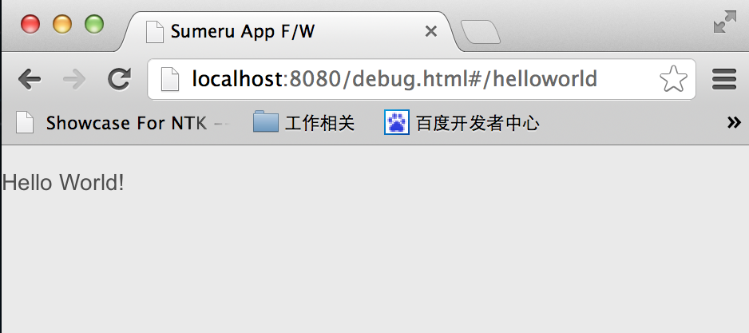

## 从这里开始


### 一. sumeru下载与安装


#### 1.1 安装

我们的sumeru是基于node.js运行，如果你的电脑已经安装了node.js环境，那么你可以使用下面命令很方便的安装sumeru。

我们先使用npm安装sumeru包：

	npm install -g sumeru
	
当sumeru包安装完成后，我们就可以使用sumeru开发自己的应用啦！在这之前我们需要先创建一个存放应用的文件夹，命令如下：

	sumeru init ./myproject
	
其实，当应用文件夹创建完成，一个基于sumeru的简单应用就诞生了，让我们先来看看他长什么样！

	cd myproject
	
	cd server
	
	node run.js
	
打开浏览器，在地址栏中输入 “localhost:8080/debug.html” 就可以看到咯！

#### 1.2 直接下载

当然，如果你觉得使用命令安装不符合你的风格，我们也提供直接下载sumeru目录的方式来生成应用目录，如果这是你想要的[请猛击这里](http://baidu.com)

### 二. “Hello World”


上面我们已经看到了一个基于sumeru的简单应用（It works），下面让我们来看看如何使用sumeru开发一个简单的应用“Hello World”。


###### 第一步：找到应用文件夹（myproject）下的controller文件夹，在该文件下创建helloworldController.js文件，打开helloworldController.js文件，并拷贝已下内容到文件中


* helloworldController.js


		sumeru.router.add(

			{
				pattern: '/helloworld',
				action: 'App.helloworld'
			}

		);

	通过以上代码我们先添加一个router建立URl中hash部分与Controller之间的关系，关于router的具体用法我们会在后面的文档中做详细的说明，然后创建具体的controller。
	
		App.helloworld = sumeru.controller.create(function(env,session){

			env.onrender = function(doRender){
				doRender("helloworld",["push", "left"]);
			};

		});	
	
###### 第二步：修改controller文件下package.js文件


* package.js:

		sumeru.packages(

			'helloworldController.js'

		);

	package.js会将文件之间的依赖关系添加到应用中，其具体的用法在后面会做详细的介绍。

	

###### 第三步：转到应用文件夹（myproject）下的view文件夹下，在该文件夹下创建helloworld.html，并拷贝已下内容到文件中

* helloworld.html

	
		
 Hello World! 

		

恭喜你已经完成了基于sumeru开发的第一个应用“Hello World”，来让我们来看看他是什么样的？

在浏览器中输入“localhost:8080/debug.html#/helloworld”,是否跟我的一样呢？



### 三. sumeru目录介绍


通过上面动手开发“hello world”,对于使用sumeru开发有了基本的了解,下面我们回过头来看看sumeru是什么样的结构,有哪些部分组成?


* ###### assets/

	如果你的应用用到一些资源文件,比如图片、CSS等可以放在assets文件夹下
		

* ###### config/

	sumeru的配置文件放在该目录下
		
 * ######  controller/
 
	我们开发的controller文件都放在这里
	
* ######  model/

	我们开发的model文件都放在这里
	
 * ###### view/

 	我们开发的view文件都放在这里
 	
 * ###### publish/

 	publish/下的文件都运行在Server上，文件中定义了Server将什么类型的数据发布到端上
	
 * ###### debug.html
 
	应用线下入口
	
 * ###### package.js
 
	将文件或者文件夹的依赖关系添加到sumeru中
	
* ###### library

	代码库,我们可以添加自己的代码到代码库中
		
 * ###### server/ 、 sumeru/

	sumeru框架文件，开发者可不关注

	

	







 
	