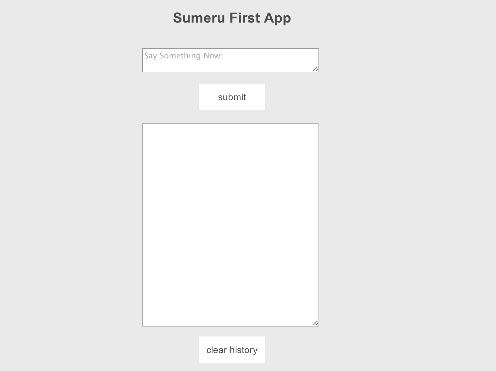

#Your First App

sumeru是以Javascript为唯一开发语言并专注于开发移动App的云端统一开发框架，使用sumeru开发的App，既可以作为Web App运行，也可以打包作为Native App安装，其以打造全新App架构为使命，提供使用Javascript抹平云和端的新世界，你将不再需要切换语言分别编写服务器和客户端逻辑；你将不再需要花费原来50%以上的精力遍历、操作DOM和管理链接，只需专心编写最核心的业务逻辑。

在《从这里开始》中介绍了如何使用sumeru开发“hello world”，现在我们真正使用sumeru开发一个App。

### 首先预览一下这个App

###（1）在"app/model/"下创建firstApp.js，输入以下代码：

* firstApp.js

		Model.firstApp = function(exports){
	
			exports.config = {
		
				fields : [
					{name: 'content', type: 'text'},
					{name: 'time', type: 'datatime',defaultValue: 'now()'}
				]

			};
		};

   使用model建立信息的数据模型，关于model在后续会做专门的说明。	

###（2）修改“app/model/package.js”

* pacakge.js

		sumeru.packages(
			'firstApp.js'
		);

		
###（3）在"app/publish/"下创建firstApp.js，输入以下代码

* firstApp.js

		module.exports = function(fw){

			fw.publish('firstApp', 'pub-firstApp', function(callback){

				var collection = this;

				collection.find({}, {}, function(err, items){
					callback(items);
		 		});
			});   
		}

	该文件定义了Server将什么类型的数据发布到客服端，关于publish后续会做专门介绍。


### (4) 在"app/controller/"下创建firstApp.js


* firstApp.js


		sumeru.router.add(

			{
				pattern: '/firstapp',
				action : 'App.firstApp'
			}
		);

		App.firstApp = sumeru.controller.create(function(env, session){
		
			var getMsgs = function(){       

				session.messages = env.subscribe('pub-firstApp', function(msgCollection){
		
					//manipulate synced collection and bind it to serveral view blocks.
		            session.bind('firstApp', {
		            	data    :   msgCollection.get(msgCollection.find().length - 1),
		            });              

		        });
			};
		
			//onload is respond for handle all data subscription
			env.onload = function(){            
				return [getMsgs];            
			};
		
			//sceneRender is respond for handle view render and transition
			env.onrender = function(doRender){
				doRender('firstApp', ['push', 'left']);
			};
		
			//onready is respond for event binding and data manipulate
			env.onready = function(){
		
				session.event('firstApp', function(){                   
		     		document.getElementById('messageSubmit').addEventListener('click', submitMessage); 

		     		document.getElementById('clearHistory').addEventListener('click',clearHistory);                             
		        });
			};
		
			var submitMessage = function(){
				var input = document.getElementById('messageInput'),
		        	inputVal = input.value.trim();
		
		       	if (inputVal == '') {
		           return false; 
		       	};
		
		       	session.messages.add({
		           content : inputVal,         
		       	});

		       	session.messages.save();
		       	input.value = '';          
			};

			var clearHistory = function(){
				seesion.messages.destroy();
				seesion.messages.save();
			}
		
		});

		
	大家发现了这里的controller与《从这里开始》中的controller不一样，多了"env.onload()"和"env.onready()"方法，关于controller后续将做专门的说明。
		

###（5）修改"app/controller/package.js"

* pacakge.js

		sumeru.packages(
			'firstApp.js'
		);

		

###（6）在"app/view/"下创建firstApp.html

* firstApp.html

		<block tpl-id="firstApp">
			

		
				<h1 style="margin-top: 20px;">Sumeru First App</h1>			
		 		<textarea id="messageInput" placeholder="Say Something Now:" style="width: 260px;margin-top: 20px;"></textarea>  
		   		<button id="messageSubmit" style="height: 40px;width: 100px; margin-top: 10px ; background-color: #fff">submit</button>  
				<textarea readonly="readonly" id="content" style="width: 260px; margin-top: 20px;">{{data.content}}</textarea>  		
				<button id="clearHistory" style="height: 40px;width: 100px; margin-top: 10px ; background-color: #fff">clear history</button> 	
			

		</block>

至此，App代码部分已经完成，在浏览器中输入"localhost:8080/debug.html#/firstapp"运行App。
	

